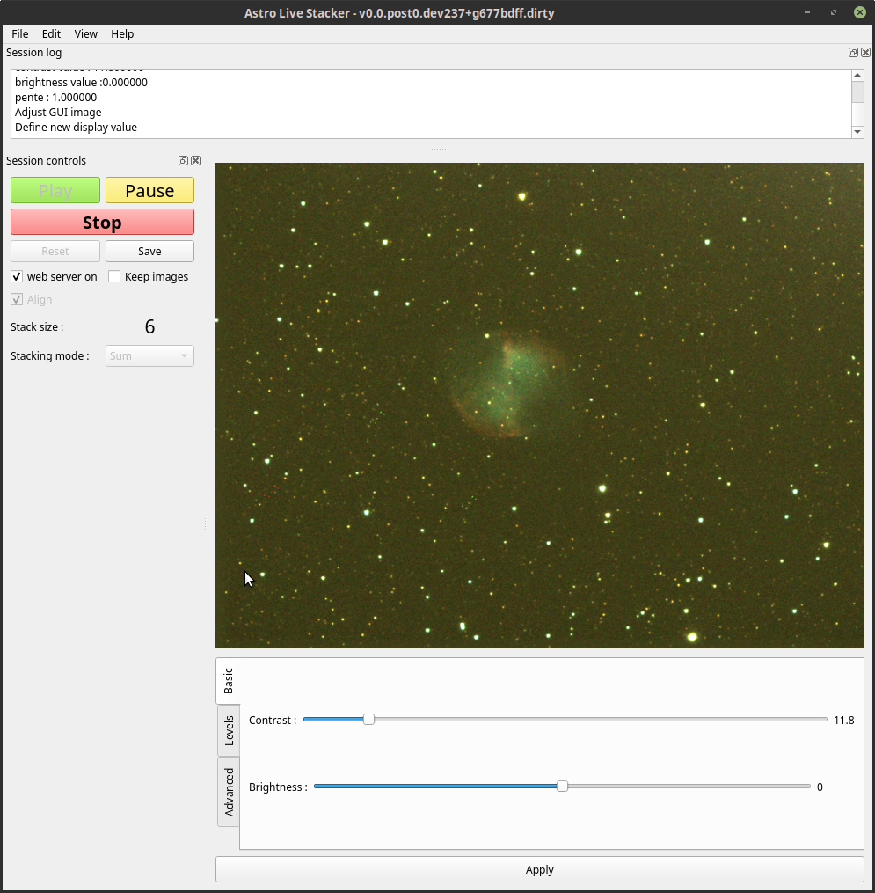

========================
ALS - Astro Live Stacker
========================

.. image:: https://img.shields.io/github/license/gehelem/als   :alt: GitHub
.. image:: https://img.shields.io/travis/com/gehelem/als   :alt: Travis (.com)

Description
===========

A standalone Python GUI application for live astrophotography stacking.

Features
========

ALS polls a folder on your machine and aligns + stacks any new image written in that folder.
User can then enhance the resulting image with various processes :

- contrast
- brightness
- levels
- RGB balance
- SCNR
- Wavelets

Resulting image can also be served by a built-in web server, so your mates at the astro club can see
your wonderful images.

Installing
==========

Until ALS is properly released to the usual software outlets, the best wat to run ALS on your machine
is to use Python's virtual envs.

