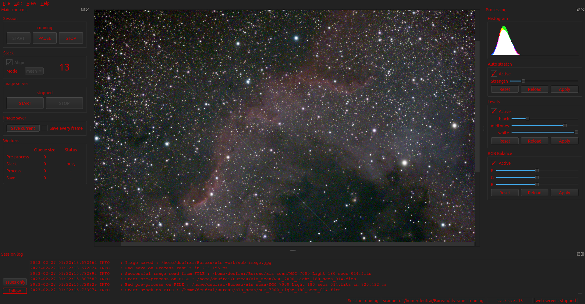

========================
ALS - Astro Live Stacker
========================

.. image:: https://img.shields.io/travis/com/gehelem/als/develop
.. image:: https://img.shields.io/github/license/gehelem/als

A desktop application for astrophotography live stacking.

Features
========

ALS polls a folder on your machine and aligns + stacks any new picture saved into that folder.

ALS is compatible with `.fit` and `.fits` in 8bits and 16bits unsigned (B&W, RGB, and No Debayering)
and with RAW camera files : https://www.libraw.org/supported-cameras

As pictures are added to the stack, user can enhance the resulting image with various processes :

- auto stretch
- levels
- RGB balance

The resulting image can be saved to disk and served by a built-in web server, so your mates at the astro
club can see your wonderful images.

Download
========

**The following download and install procedure has been tested on a freshly installed Ubuntu 18 LTS (a.k.a. Bionic).
Your mileage may vary.**

Until ALS is properly released to the usual software outlets, you have two options to get ALS on your computer :
`Download an archive from GitHub`_ or `Clone the whole source code repo`_.

One word about what ALS versions you have access to, using either option : Stable ALS releases are available
via downloadable archives published on ALS's GitHub page. If you want to check what will be part of the next stable
release, then cloning the repo is the way to go.

Download an archive from GitHub
+++++++++++++++++++++++++++++++

#. Point your browser of choice to the `ALS GitHub releases page <https://github.com/gehelem/als/releases>`_
#. CLick the version you want to use
#. Download desired archive format, zip or tar.gz
#. Extract the archive in the folder of your choice

Clone the whole source code repo
++++++++++++++++++++++++++++++++

1. Check if git is available on your system : Ask for git version in a terminal :

.. code-block:: shell

  $ git --version
  git version 2.17.1

if you get an error like :

.. code-block:: shell

  $ git --version
  git: command not found

Then you need to install git on your system. Simply issue the following command :

.. code-block:: shell

  $ sudo apt-get update && sudo apt-get install -y git

2. clone ALS repo : you'll have to specify the branch you want to check out : ``master`` for latest stable release,
``develop`` for bleeding edge features. Your desired branch name must be used after the ``-b`` option in the command
below :

.. code-block:: shell

  $ git clone https://github.com/gehelem/als.git -b <branch_name_chosen_above>

Installation
============

In order to manage ALS's various dependencies without modifying your current system's Python install and libraries, you
are advised to use Python Virtual Environments. The below procedure will guide you through the process of creating a
virtual environment and installing ALS's dependencies into it.

.. note::

  All below commands have to be used in your terminal of choice. In all of them, please replace ``ALS_HOME`` with the
  actual path of the folder in which you extracted the GitHub archive or cloned de ALS repo. See `Download`_ section for
  details

1. **Install a few system packages** :

- `gcc` and `python3-dev` to compile some dependencies (don't be scared)
- `python3-venv` to handle virtualenvs
- `indi` and gsc catalog `gsc` to enable indi support

.. code-block::

  $ sudo add-apt-repository -y ppa:mutlaqja/ppa && sudo apt update

.. code-block::

  $ sudo apt install -y gcc python3-dev python3-venv indi-full gsc swig zlib1g-dev

2. **Dive into ALS folder**.

.. code-block::

  $ cd ALS_HOME

3. **Create your virtualenv with provided script**

   This will create a folder named `venv` inside the `ALS_HOME` folder, then download and install all dependencies into
   it.

.. code-block::

  $ ./utils/venv_setup.sh

4. **Activate the newly created virtualenv**

.. code-block::

  $ source ./venv/bin/activate

5. **Setup ALS into your virtualenv in development mode**. This is for now the only supported setup mode.
   This allows you to run ALS easily, as it adds a launcher script inside your active virtual env.

.. code-block::

  $ python setup.py develop

Launching ALS
=============

1. **Make sure your virtualenv is active**

   If your virtualenv is active, your command prompt is prepended with (venv). See example below :

.. code-block::

  (venv) user@host:~/als$

If you don't see the `(venv)` part before your command prompt, this means your virtualenv is not active.
Activate it using steps 4 & 5 of the `Installation`_ procedure.

2. **just launch ALS from anywhere** :)

.. code-block::

  $ als

Using ALS
=========

1. Launch ALS
2. Click the 'START' button

   If the configured scan folder does not exist, follow ALS advice and review your preferences

3. Setup you image acquisition system to save new pictures into the folder scanned by ALS
4. Start picture acquisition
5. Watch the magic do its work

Developing ALS
==============

On top of the steps described in `Installation`_ and `Launching ALS`_, you don't need much to start developing on ALS.

All you have to remember when you work on GUI: ALS uses the Qt framework. If you modify/create .ui files, you'll have to
recompile the corresponding Python modules. This is done by calling the following script : `utils/compile_ui_and_rc.py`.
All .ui files MUST be located inside the `als.ui` package. Compiled modules are located in the
`als.generated` package.

For any other non GUI code, just edit the code and relaunch `als` each time you want to check your changes.

If you want to perform basic checks on the code before committing and pushing your changes, execute the
following command from within the `als` folder. If the script's exit code is 0 (zero), your code is safe
to be pushed. It may not yet do exactly what it is meant for, but at least it won't cause runtime errors
due to syntax errors.

.. code-block::

  $ ./ci/full_build.sh

Happy hacking !!!
