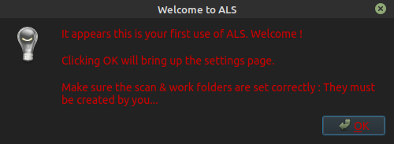
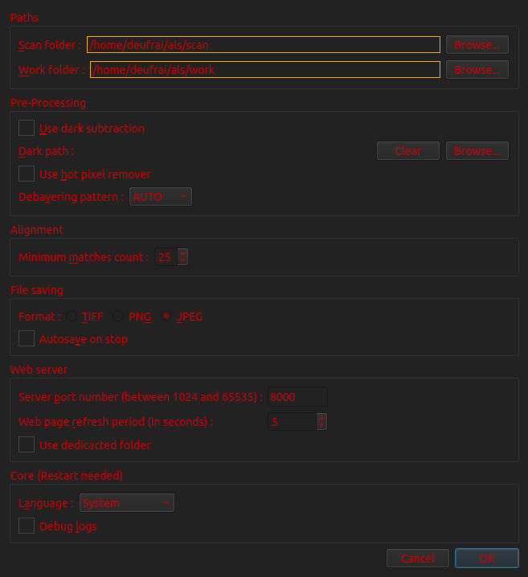

############
First Run
############

Minimal configuration
=====================

Before it can run, ALS needs to know about 2 folders :

- The **scan** folder : The folder ALS will **monitor** for the arrival of **new frames**. *This is typically
  the folder where your current setup is set to save captured frames*.

- The **work** folder : The folder where ALS will save its images. *We recommend you create a new folder dedicated to
  ALS output files*.

On ALS first run, you are asked to set these 2 paths in ALS preferences.

Clicking ``OK`` will open the **preferences** and highlight the 2 fields that need your input.

Use the 2 first ``Browse...`` buttons to setup your **scan** & **work** folders, then click ``OK``

This will complete the setup and bring up ALS on your screen.

Your first live stacking session
================================

Let's have a look at ALS window layout and focus on the top left panel. It is named **Main controls** and contains
a few sections :

.. container:: als-twocol

    .. container:: als-left-wide

        - **Session** : everything control and monitor your current session :

            - **session status** : current session status. Reads ``stopped``, now.
            - **3 buttons** :

                - **START** : start monitoring the **scan** folder and process every **new** image.
                - **PAUSE** : stop monitoring the **scan** folder. All other processes keep running.
                - **STOP** : stop monitoring the **scan** folder and reset the stack. Currently displayed image can still
                  be tweaked with the post-processors and saved to disk .

        - **Stack** : control and monitor the stacking.

            - **align switch** : do we want to align frames before stacking. (Default to Yes)
            - **stack mode** : choose from mean to sum
            - **stack size** : how many frames have been stacked in the current sessions so far

    .. container:: als-right-narrow

        .. image:: ./_img/first_run_controls.png

As a quickstart, we are simply leaving everything as it is and hit that big ``START`` button.

JUST PUSH START :)
******************

BABWE

.. toctree::
   :hidden: