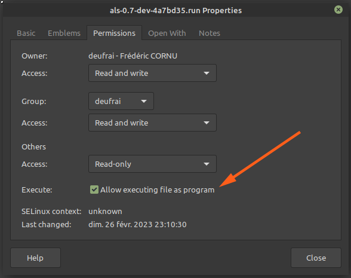
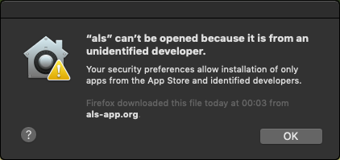
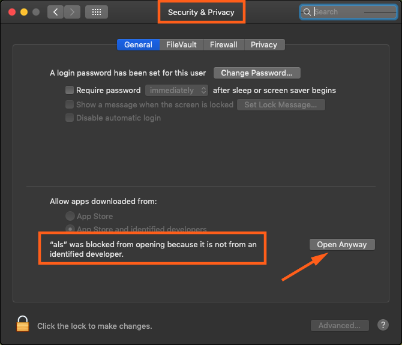
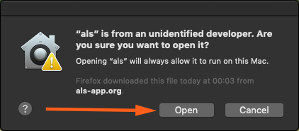

#######
Get ALS
#######

System requirements
===================

We provide downloads for the following systems :

- Linux on 64 bits PC
- Linux on 32 bits Raspberry Pi (v4 highly recommended)
- Windows
- macOS on Intel CPUs only

If your system is not supported, you still can run ALS from source code.
Just browse to https://github.com/gehelem/als to get the code and setup procedure.

Download
========

.. centered:: https://als-app.org/nightlies/latest

Install
=======

Windows
*******

Download the ``als.exe`` file anywhere on your computer.

Launch ALS by the usual double-click :)

Linux for desktop PCs
*********************

Download the ``als-<version>.run`` file anywhere on your computer

Allow your system to execute it by editing its properties

Launch ALS by executing the ``als-<version>.run`` file.

Linux for 32bit Raspberry Pi
****************************

Download the ``als-<version>.tgz`` archive and extract it anywhere on your computer.
Launch ALS by executing the ``als-<version>`` file located in the extracted folder.

macOS
*****

Download the ``ALS-<version>.dmg`` file and let your mac do its magic :)

We are not registered Apple Developers, so you'll have to approve a security check.

Browse to the "Security & Privacy " section of your system settings, make sure you see the warning about ALS and open
it anyway :)

You way also bump into this one...

.. toctree::
   :hidden: